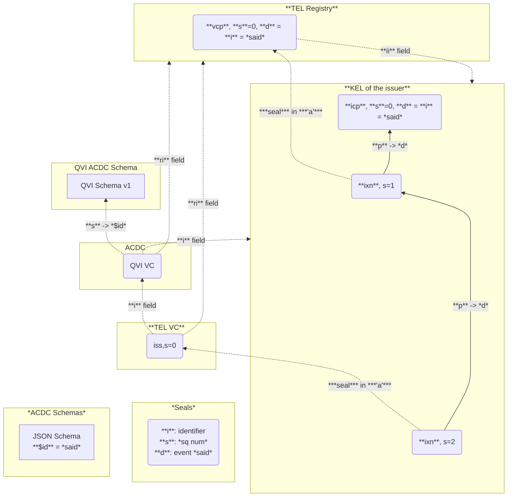

# Description of **KEL** and **TEL** for vLEIs

```mermaid
graph BT
    kel_e1-.->|***seal*** in ***'a'***|tr_e0
    kel_e2-.->|***seal*** in ***'a'***|tel_vc_e0
    tel_vc_e0 -.-> |**ri** field|tel_registry
    tel_vc_e0 -.-> |**i** field|qvi_cred1
    tr_e0-..->|**ii** field|kel
    qvi_cred1-.->|**i** field|kel
    qvi_cred1-.->|**ri** field|tel_registry

    subgraph kel[**KEL of the issuer**]
    direction BT
    kel_e1(**ixn**, s=1)-->|**p** -> *d*|kel_e0(**icp**, **s**=0, **d** = **i** = *said*)
    kel_e2(**ixn**, s=2)-->|**p** -> *d*|kel_e1
    end
    subgraph tel_registry[**TEL Registry**]
    tr_e0(**vcp**, **s**=0, **d** = **i** = *said*)
    end
    subgraph tel_vc[**TEL VC**]
    tel_vc_e0(iss,s=0)
    end
    subgraph ACDC
    qvi_cred1(QVI VC)
    end
    subgraph Seals[*Seals*]
      seal(**i**: identifier
      **s**: *sq num*
      **d**: event *said*)  
    end
    subgraph Schema[*ACDC Schemas*]
    schema[JSON Schema
    **$id** = *said*]
    end
    subgraph qvi_schema[QVI ACDC Schema]
    qvi_schema_v1[QVI Schema v1]
    end
    qvi_cred1-.->|**s** -> *$id*|qvi_schema_v1

```